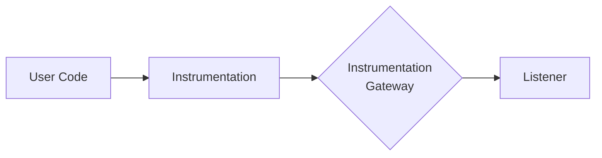
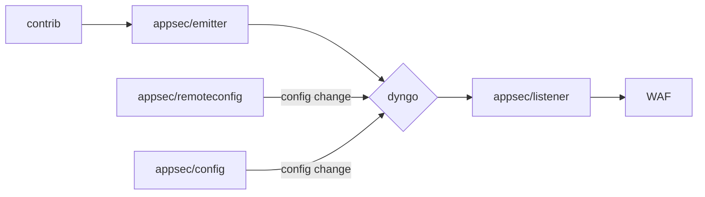
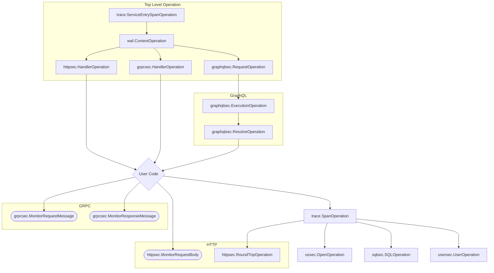
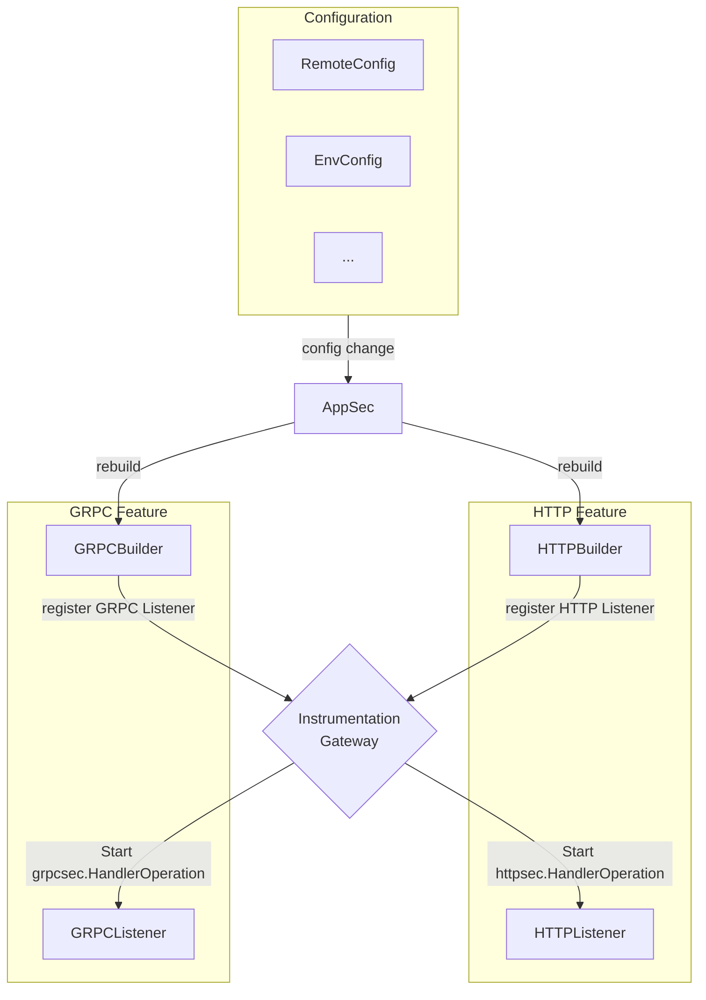

# Appsec Go Design

This document describes the design of the `internal/appsec` package and everything under it. This package is responsible
for securing the application by monitoring the operations that are executed by the application and applying actions in
case a security threats is detected.

Most of the work is to forward information to the module `github.com/DataDog/go-libddwaf` which contains the WAF
(Web Application Firewall) engine. The WAF does most of the decision making about events and actions. Our goal is to
connect the different parts of the application and the WAF engine while keeping up to date the various sources of
configuration that the WAF engine uses.

### Fiber request monitoring

The Fiber v2 middleware starts the WAF operation before the handler chain. It
keeps the raw request target for WAF inspection and uses fasthttp's parsed query
values. Invalid escapes and semicolons must not disable monitoring or remove
values that the application can read.

With AppSec enabled, the middleware renders returned errors through Fiber's
configured error handler before it reports the response to the WAF. The error
handler runs once when needed. The original error is recorded on the span
unless AppSec blocks the response; then the block is reported instead.
Earlier middleware receives `nil` from `c.Next()` for these handled errors;
error logging or counting belongs in the configured error handler. With AppSec
disabled, error propagation is unchanged. A pending block takes priority over
the error handler and replaces the handler's body and headers.

Use `fibertrace.Wrap(app, opts...)` before registering routes or middleware, and
wrap each mounted app. Without a child app's own `Wrap` call, its parameters are
checked only after its handlers return, so a block cannot prevent their side
effects. `Wrap` installs route guards during setup. Fiber's matcher
supplies the parameters to these guards before they call user handlers, so a
path-parameter block prevents those handlers from running. Consecutive route
registrations can share a handler chain; every appended handler is guarded.
Repeated `Wrap` calls apply options without adding another middleware. Mounted
apps share the first wrapped app's request span and options. This includes
`WithIgnoreRequest`: if the first app ignores the request, mounted apps also
skip tracing and AppSec. Calls to `Wrap` on the same app must not run concurrently,
and all route registration must finish before serving requests. A block in a
parameterized group middleware reports that group's route; the endpoint has not
been reached yet.

Use `Wrap` instead of `app.Use(fibertrace.Middleware())`; do not install both.
The older global `Middleware` form remains compatible, but it can only report
endpoint parameters after the handler chain and cannot prevent those handler
side effects. Orchestrion uses `Wrap` automatically. Parsed bodies still require
an explicit `appsec.MonitorParsedHTTPBody(c.UserContext(), body)` call; there is
no automatic `BodyParser` hook.

Register panic-recovery middleware immediately after `Wrap`, or immediately
after `Middleware` when using the older API, before other middleware and routes.
Recovery then runs inside the monitored handler chain, so
the configured error handler renders the response before the WAF inspects it.
Recovery registered before tracing runs too late: AppSec cannot inspect its
final response or prevent it from overwriting a pending block. That ordering
is not supported for AppSec panic handling. Tracing does not install or replace
recovery, and unrecovered panics still propagate. Custom recovery callbacks
remain under application control. With AppSec disabled, Fiber still renders
returned errors after tracing returns; the span's status can describe the
pre-error response rather than the final wire status. This behavior is unchanged.

The Fiber contrib tests cover parsing, error responses, blocking, and connection
reuse. The Orchestrion Fiber case verifies blocking without manual middleware.
The AppSec CI matrix includes Fiber, and `BenchmarkFiberMiddleware` measures
requests with AppSec off and on.

### Instrumentation Gateway: Dyngo

Having the customer (or orchestrion) instrument their code is the hardest part of the job. That's why we want to provide
the simplest API possible for them to use. This means loosing the flexibility or enabling and disabling multiple
products and features at runtime. Flexibility that we still want to provide to the customer, that's why behind every
API entrypoint present in `dd-trace-go/contrib` that support appsec is a call to the `internal/appsec/dyngo` package.



Dyngo is a context-scoped event listener system that provide a way to listen dynamically to events that are happening in
the customer code and to react to configuration changes and hot-swap event listeners at runtime.



### Operation definition requirements

* Each operation must have a `Start*` and a `Finish` method covering calls to dyngo.
* The content of the arguments and results should not require any external package, at most the standard library.

Example operation:

```go
package main

import (
	"context"

	"github.com/DataDog/dd-trace-go/v2/instrumentation/appsec/dyngo"
	"github.com/DataDog/dd-trace-go/v2/internal/log"
)

type (
	ExampleOperation struct {
		dyngo.Operation
	}

	ExampleOperationArgs struct {
		Type string
	}

	ExampleOperationResult struct {
		Code int
	}
)

func (ExampleOperationArgs) IsArgOf(*ExampleOperation)      {}
func (ExampleOperationResult) IsResultOf(*ExampleOperation) {}

func StartExampleOperation(ctx context.Context, args ExampleOperationArgs) *ExampleOperation {
	parent, ok := dyngo.FromContext(ctx)
	if !ok {
		log.Error("No parent operation found")
		return nil
	}
	op := &ExampleOperation{
		Operation: dyngo.NewOperation(parent),
	}
	return dyngo.StartOperation(op, args)
}

func (op *ExampleOperation) Finish(result ExampleOperationResult) {
	dyngo.FinishOperation(op, result)
}
```

> [!CAUTION]
> Importing external packages in the operation definition will probably cause circular dependencies. This is because
> the operation definition can be used in the package is will instrument, and the package that will instrument it will
> probably import the operation definition.

### Operation Stack

Current state of the possible operation stacks



> [!IMPORTANT]
> Please note that this is how the operation SHOULD be stacked. If the user code does not have a Top Level Operation
> then nothing will be monitored. In this case an error log should be produced to explain thoroughly the issue to
> the user.

### Features

Features represent an abstract feature added to the tracer by AppSec. They are the bridge between the configuration and
its sources
and the actual code that needs to be ran in case of enablement or disablement of a feature. Features are divided in two
parts:

- The builder that should be a pure function that takes the configuration and returns a feature object.
- The listeners that are methods of the feature object that are called when an event from the Instrumentation Gateway is
  triggered.

From there, at each configuration change from any config source, the AppSec module will rebuild the feature objects,
register the listeners to the Instrumentation Gateway, and hot-swap the root level operation with the new one,
consequently making the whole AppSec code atomic.

Here is an example of how a system with only two features, GRPC and HTTP WAF Protection, would look like:



All currently available features are the following ones:

| Feature Name           | Description                                            |
|------------------------|--------------------------------------------------------|
| HTTP WAF Protection    | Protects HTTP requests from attacks                    |
| GRPC WAF Protection    | Protects GRPC requests from attacks                    |
| GraphQL WAF Protection | Protects GraphQL requests from attacks                 |
| SQL RASP               | Runtime Application Self-Protection for SQL injections |
| OS RASP                | Runtime Application Self-Protection for LFI attacks    |
| CMDi RASP              | Runtime Application Self-Protection for command injection attacks |
| HTTP RASP              | Runtime Application Self-Protection for SSRF attacks   |
| User Security          | User blocking and login failures/success events        |
| WAF Context            | Setup of the request scoped context system of the WAF  |
| Tracing                | Bridge between the tracer and AppSec features          |

### AppSec state checks

`Enabled` and `RASPEnabled` load the active AppSec instance and its started state
atomically. Query hooks do not take the lifecycle mutex. Instance replacement
remains serialized, and remote activation updates the instance's atomic state.

### SQL monitoring in pgx

The native pgx integration only monitors SQL; it cannot block it. See
[contrib/jackc/pgx.v5/README.md](../../contrib/jackc/pgx.v5/README.md#appsec-sql-injection-monitoring)
for its behavior and limitations.
