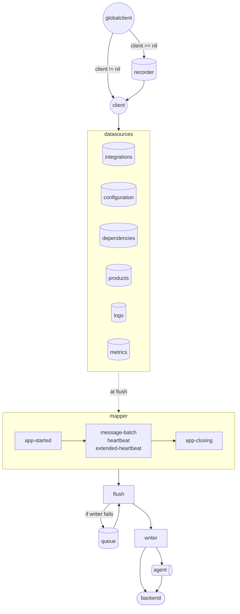

# Instrumentation Telemetry Client

This documentation details the current architecture of the Instrumentation Telemetry Client of dd-trace-go and was are its capabilities.

### Data Flow

```mermaid
flowchart TD
    linkStyle default interpolate basis
    globalclient@{ shape: circle } -->|client == nil| recorder
    globalclient -->|client != nil| client
    recorder@{ shape: cyl } --> client@{ shape: circle }

    subgraph datasources
        integrations@{ shape: cyl }
        configuration@{ shape: cyl }
        dependencies@{ shape: cyl }
        products@{ shape: cyl }
        logs@{ shape: cyl }
        metrics@{ shape: cyl }
    end

    client --> datasources

    subgraph mapper
        direction LR
        app-started -->
        default[message-batch<div>heartbeat<div>extended-heartbeat] --> app-closing 
    end
        
    flush@{ shape:rounded }

    queue@{ shape: cyl } --> flush

    datasources -..->|at flush| mapper --> flush
    flush -->|if writer fails| queue

    flush --> writer

    writer --> agent@{ shape: das }
    writer --> backend@{ shape: stadium }
    agent --> backend
```
